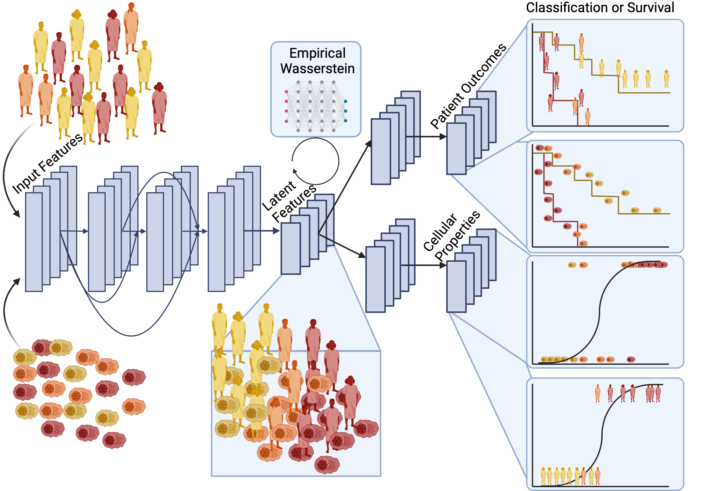

# Diagnostic Evidence GAuge of Single cells (DEGAS) version 2
**This is bold**
Package development by:

Ziyu Liu

Travis S. Johnson (https://github.com/tsteelejohnson91)

Sihong Li (https://github.com/alanli97)

DEGASv2

Installation

Step 1 Install devtools in R

install.packages("devtools")

Step 2 Install Biocmanager in R

install.packages("BiocManager")

Step 3 Install DESeq2

library(BiocManager)

BiocManager::install("DESeq2")

Step 4 Install DEGAS in R (Please refer to DEGAS's installation instruction from "https://github.com/tsteelejohnson91/DEGAS" for required python and r packages)

library(devtools)

install_github("tsteelejohnson91/DEGAS")

Step 5 Install DEGASv2 in R

install_github("alanli97/DEGASv2")
